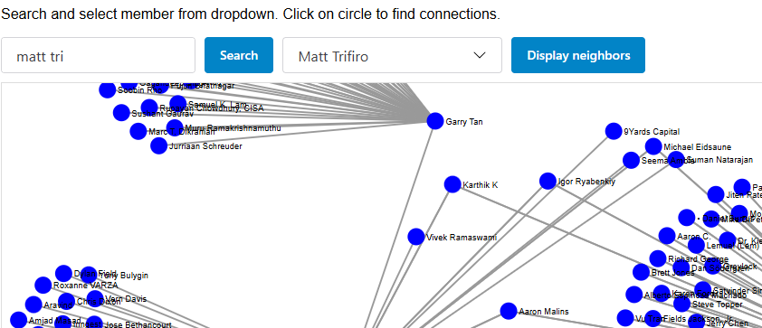

# LinkedIn Post Analysis

This application allows you to upload a .jsonl file containing LinkedIn posts and then it generates a graph of connections between LinkedIn members. Nodes represent individuals/companies, and edges connect them based on interactions such as posting, commenting, and resharing. A simple Streamlit UI is provided to interact with the application and visualize connections.


# Install


## Python install
First, install the required Python version and dependencies:

```sh
sudo apt install python3
sudo apt install python3-pip
sudo apt install python3.11-venv
```

## Project install
Clone the repository and set up a virtual environment:

```sh
git clone https://github.com/atul-github/linkedin-posts poc
cd poc
python3 -m venv myenv
source myenv/bin/activate
```

Next, install the project dependencies:

```
sudo apt-get install libpq-dev python3.11-dev
pip install pyvis beautifulsoup4 python-dotenv aiohttp networkx pandas streamlit psycopg2 numpy

```
Please donot use requirements.txt as it may take very long time.


# Environment Variables
Create a .env file or add the following environment variables:

```
OLLAMA_URL=http://localhost:11434/api/generate
OLLAMA_MODEL=llama3.1:latest
```
If OLLAMA_URL is set, the application will use OLLAMA. Otherwise, it will default to GPT. 
If you have access to GPT-4, set the following:
```
URL=https://<your url>/openai/deployments/<your deployment>/chat/completions?api-version=2024-02-15-preview
API_KEY=<your key>
```

# Running streamlit application

## Run (without postgres)

```sh
python -m streamlit  run main.py --server.port=8002 --server.address=localhost --server.maxUploadSize=900
```

## Run (with postgres)

By default application doesn't use database. And keeps data in pandas dataframe. If you want to see data persisted, you can run app with postgresql.
To run with PostgreSQL, add the following to your environment variables or .env file:

```
USE_PG=1
```
Please run **pg.sql** to create two tables.


## Running d3js
To visualize connections using a D3.js application, follow these steps:

Start the Streamlit application and upload the .jsonl file.
    Once the file is successfully uploaded, run the Python HTTP server:

    
```sh
python -m http.server 8003
```

and browse to http://localhost:8003/d3.html 



# Using App

* When launched for the first time, you will be prompted to upload .jsonl file
* File uploads may take a few minutes, depending on size. :(
* YYou can search LinkedIn members by typing in the search box (e.g., typing 'a' will populate around 100 LinkedIn members - name starts with 'a' or 'A' in the dropdown). Click outside the text box to trigger the search.
* Click Submit button to check for direct relationships between members.
* Click Connectedness - It will give directed path between two memebers if exists.
* Execute LLM - Classifies the relationship between members. You will need access to GPT-4 or OLLAMA for this feature.
* Refresh the page to upload another file

# Other experiments

Note that I had to download many add-ins separately because of network issues.

## Setiment analysis using spacytextblob

```sh
pip install spacy spacytextblob textblob torch
pip install ".\en_core_web_sm-3.8.0-py3-none-any.whl"
python spacytextblob_test.py
```

## Vader sentiment

```sh
pip install vaderSentiment
python vader_sentiment_test.py
```

## Benpar to find entities in text
```
pip install benepar
pip install .\en_core_web_trf-3.8.0-py3-none-any.whl
python benepar_test.py
```

## Title model for ranking
```
pip install scikit-learn
python titles_model.py
```

# Approach

* Upload .jsonl file and read each JSON object line by line.
* Use NetworkX to create nodes (individuals) and edges (connections) for the directed graph. I opted for NetworkX in-memory due to its simplicity, though **Neo4j** could be used for larger datasets.
* Create a node for every person who has posted, who has shared, who has commented on post or was mentioned by others.
* Create edges from commenter to poster, resharere to poster and then to mentions. 
* Weight Calculation: Edge weights are calculated based on the type of interaction (e.g., mutual relationships are given higher weight while edges with co-commenter are having lower weight )
* Weight is also used while finding path between two members when

## 1. Without using AI/ML technique
* This method relies solely on mathematical analysis, counting interactions between members.

**Pros**:
Quick to implement
Useful for basic analysis, such as frequency of communication or familiarity

**Cons**:
Limited in understanding deeper relationships (e.g., whether they are close colleagues or casual acquaintances)


## 2. Using LLM(e.g., GPT-4 or OLLAMA)

**Pros**: 
More accurate relationship classification
Easy to implement and adapt with better prompts

**Cons**: 
'Cost' - Although $2.5 / 1M token cannot be called expensive. This is GPT4o pricing. If we do smart batch processing, cost will be less and we  can easily get nice output for millions of post,. 
As per my discussion, I found that processing around 100k posts would take around 1/2 hour. With this, we can calculate on how much time it will take to finish our task. 

## 3. Training Model

* Create a dataset of LinkedIn posts and rank them based on "closeness".
* Train a model using the data (fine-tune with RoBERTa or use a Transformer-based model or simple TF-IDF Logistic Regression).
* Supply text from posts to get a 'closeness' rank, which classifies the relationship between two people (e.g., Poster and Commenter).
* I attempted this with a sample posts to rank closeness/friendlyness of two members. Couldn't get good results.
* I have also attempted to create ranking based on 'titles'. 
* When I attemped with posts, results were not very good. **I need to learn** on how to train models.

**Pros** : 
Can train model with large dataset and fine tune based on needs. Customizable to specific needs

**Cons** : 
* Requires high-quality training data
* Requires expertise and many iterations to train the model

## 4. Sentiment analysis
Sentiment analysis using pre-trained models can offer insight into the tone of interactions, providing another layer of relationship context.
Sentiment value along with data, we can find out relative closeness between two members.

There is very nice [https://language.googleapis.com/v1/documents:analyzeEntitySentiment](Entity and Sentiment Analysis with the Natural Language API) that gives you every mention and sentiment. 

**Pros** : 
Easy to use.  We can use keywords like 'worked with', 'good mentor', 'had lunch', 'went on trip' etc to improve accuracy. Outcome might be better if used along with well trained model.

**Cons** : 
Same as for training model. Just by having sentiment analysis won't have good results.


# TODO

Really understand / learn all NLP concepts and apply it properly for this problem. But question is - is it really required?
With LLM, we can have post with several members interacting with each other. LLM precisely finds out who is saying what about other. 


